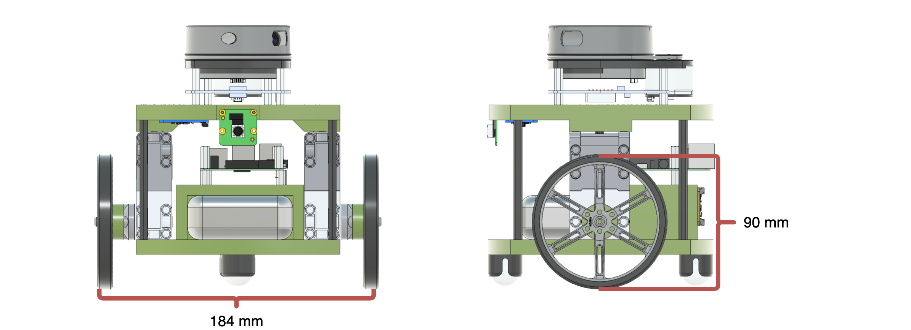

# HamBot: A Python Library for Robot Control

HamBot is a Python library designed to control a robot equipped with various sensors, including IMU, Lidar, and Camera. The library simplifies robot programming, providing easy-to-use interfaces for sensor data acquisition and motor control.


## Technical Specifications

| Component                  | Specification                                                                                                                                                                                                            |
|-----------------------------|--------------------------------------------------------------------------------------------------------------------------------------------------------------------------------------------------------------------------|
| Wheel Diameter / Radius     | 90 mm / 45 mm                                                                                                                                                                                                            |
| Axel Length (wheel spacing) | 184 mm                                                                                                                                                                                                                   |
| Max Motor Speed             | 75 RPM (approx. 7.85 rad/s)                                                            <br/>                                                                                                                             |
| Drive Motors                | LEGO Technic Large Angular Motors via Raspberry Pi Build HAT ([Datasheet](https://le-www-live-s.legocdn.com/sc/media/files/support/spike-prime/techspecs_techniclargeangularmotor-1b79e2f4fbb292aaf40c97fec0c31fff.pdf)) |
| IMU                         | Adafruit BNO055 Absolute Orientation Sensor                                                                                                                                                                              |
| LiDAR                       | Slamtec RPLidar (360° scanning)                                                                                                                                                                                          |
| Camera                      | Raspberry Pi Camera Board v2 (8 MP)                                                                                                                                                                                      |

---
## Features
- **Motor Control** using the Raspberry Pi Build HAT.
- **IMU Integration** with the BNO055 sensor for orientation and acceleration data.
- **Lidar Integration** with the RPLidar for distance measurements.
- **Camera Integration** with the Raspberry Pi Camera Board for image processing and landmark detection.

## Getting Started

### Prerequisites
- Raspberry Pi running Raspberry Pi OS.
- Python 3.6 or higher.
- Access to Raspberry Pi GPIO pins for motor control.
- Hardware components:
  - **IMU Sensor**: BNO055 (Adafruit CircuitPython library)
  - **Lidar Sensor**: RPLidar (Adafruit CircuitPython library)
  - **Camera**: Raspberry Pi Camera Board v2 - 8 Megapixels
  - **Motor Controller**: Raspberry Pi Build HAT

### Installation

```bash
git clone https://github.com/yourusername/robot_systems.git
cd robot_systems
python3 -m venv --system-site-packages hambot_env
source hambot_env/bin/activate
pip install -e .
````

## Hardware Components

Each component has its own documentation file with technical details and code examples:

* [IMU Sensor (BNO055)](docs/IMU.md)
* [Lidar Sensor (RPLidar)](docs/lidar.md)
* [Camera (Raspberry Pi Camera v2)](docs/camera.md)
* [Motors (Build HAT)](docs/motors.md)

## Class Outline

The main entry point is the **HamBot** class (`robot_systems/robot.py`):

```python
from robot_systems.imu import IMU
from robot_systems.lidar import Lidar
from robot_systems.camera import Camera
from buildhat import Motor

class HamBot:
    def __init__(self, lidar_enabled=True, camera_enabled=True):
        self.imu = IMU()               # Orientation & heading
        self.left_motor = Motor('B')   # Left wheel
        self.right_motor = Motor('A')  # Right wheel
        self.lidar = Lidar() if lidar_enabled else None
        self.camera = Camera() if camera_enabled else None
        # ... encoder tracking, shutdown handling ...
```

This class provides:

* `get_heading()` → orientation from the IMU
* `get_range_image()` → 360° scan from the Lidar
* `camera.get_image()` and `camera.find_landmarks()` → image capture and landmark detection
* Motor functions (`set_left_motor_speed`, `run_motors_for_seconds`, etc.)
* Encoder readings for odometry
* Safe shutdown/disconnect
---
## Usage Examples

Below are basic examples of how to use each component through the `HamBot` class.

### IMU: Get Heading
```python
from robot_systems.robot import HamBot

bot = HamBot(lidar_enabled=False, camera_enabled=False)
print("Heading (°):", bot.get_heading())
````

### LiDAR: Get Range Image

```python
from robot_systems.robot import HamBot

bot = HamBot(camera_enabled=False)
scan = bot.get_range_image()
print("Front distance (mm):", scan[180])
```

### Camera: Detect Landmarks

```python
from robot_systems.robot import HamBot

bot = HamBot(lidar_enabled=False)
bot.camera.set_landmark_colors([(255, 0, 0)], tolerance=0.08)  # detect red
landmarks = bot.camera.find_landmarks()
print("Landmarks:", landmarks)
```

### Motors: Drive Forward

```python
from robot_systems.robot import HamBot
import time

bot = HamBot(lidar_enabled=False, camera_enabled=False)

# Move forward for 2 seconds
bot.set_left_motor_speed(-50)   # left motor reversed
bot.set_right_motor_speed(50)   # right motor forward
time.sleep(2)

bot.stop_motors()
```


## Contributing

Contributions are welcome! Please submit a pull request or open an issue.

## License

MIT License – see [LICENSE](LICENSE)

## Acknowledgments

Special thanks to the developers of the libraries and hardware components used in this project.

